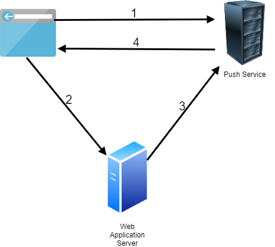
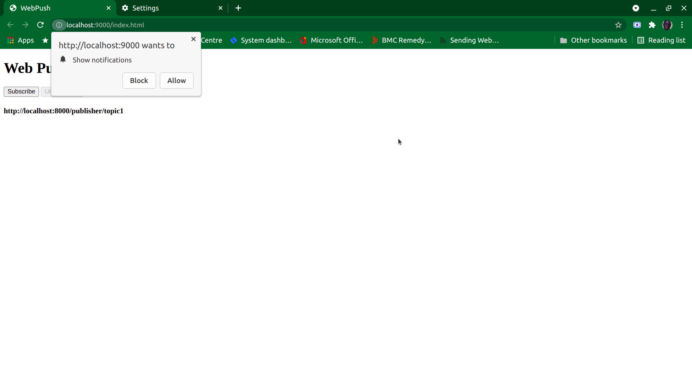
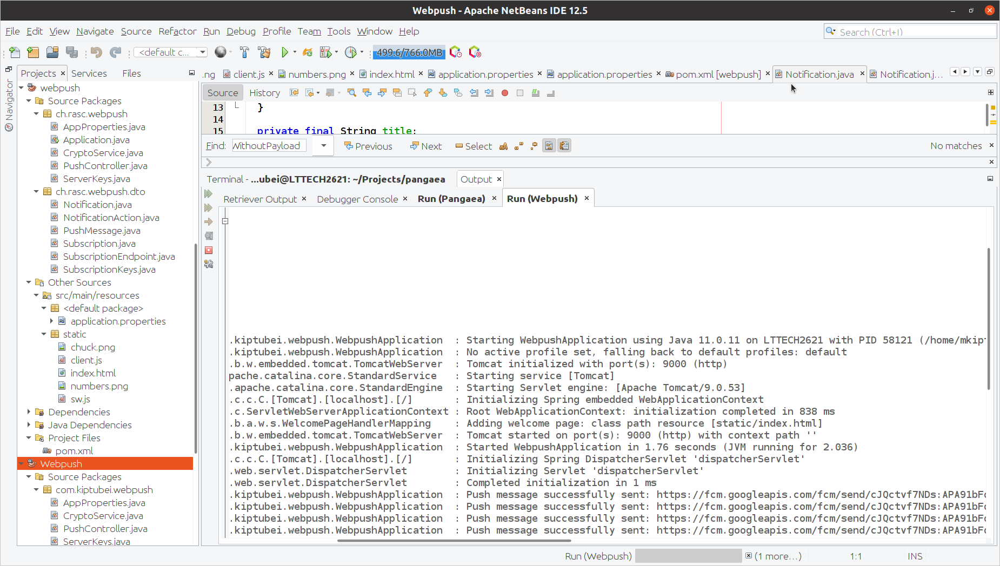
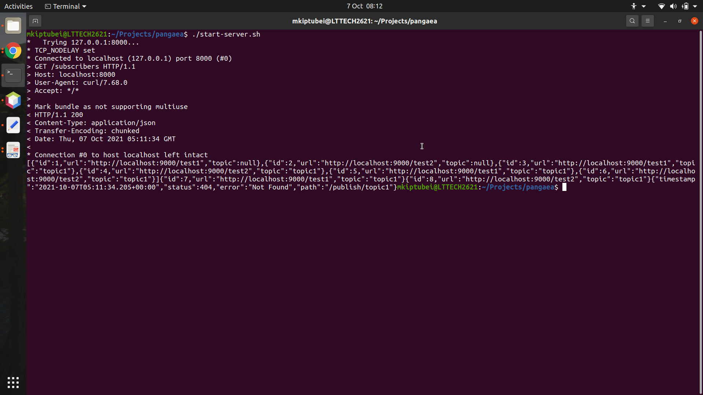

# Pangaea Notification and Subscription Service Part 1 of 2: The Back-end service
 For this challenge we'll be creating a HTTP notification system. A server (or set of servers) will keep track of topics and subscribers
where a topic is a string and a subscriber is an HTTP endpoint. When a message is published on a topic, it should be forwarded to all subscriber endpoints.

As part of the Pangaea subscription service we must create a back-end server application server from which topics will be published. This is part 1.

Please note that this repository only contains source code for the  back-end server application as depicted in the Architecture diagram below .For the push service and web client follow the link below.

Part 2 can be found [here](https://github.com/kiptubei/Pangaea-WebPush.git)

# Project Specification

For a detailed description of the assignement please refer to the 

# Project Architecture

- The application is made up of the parts:
 * Web Client
 * Push Server [source](https://github.com/kiptubei/Pangaea-WebPush.git)
 * Api Server / Back-end 
 
- The web client will register a service work and get back subscription notification from our push service.

- The browser sends the subscription information to our back end. This information contains a public key, a secret, and the address of the push service.
- Our back end creates, encrypts, and sends push notifications to the push server.
- The browser needs to register a push event listener in the Service Worker code. This handler will receive push notifications even when the web application is
 not open
 

## Built With

- Spring-Boot
- Java 11
- Apache Netbeans 12.5
- Maven
- Ubuntu 20.04 LTS

### Prerequisites

- Ubuntu
- bash terminal
- Google Chrome

### Usage
- ** Please note these instrcutions require use of Apache Netbeans IDE
- Fork/Clone this project to your local machine with the command `https://github.com/kiptubei/pangaea.git` for PART 1
- Fork/Clone the Push Service to your local machine from `https://github.com/kiptubei/Pangaea-WebPush.git` for PART 2
- Open the project in Apache Netbeans
- Clean and Build with Dependencies
- Run the projects
- Part 1 will run on port 8000 and Part 2 on port 9000

- Execute `.\start-server.sh`

## Author

👤 **Mark James Kiptubei**

- Github: [@kiptubei](https://github.com/kiptubei)
- Twitter: [@mjabei](https://twitter.com/mjabei)
- Linkedin: [Mark James Kiptubei](https://www.linkedin.com/in/kiptubei/)

## 🤝 Contributing

Contributions and feature requests are welcome!

Start by:

- Forking the project
- Clone the project to your local machine by running `https://github.com/kiptubei/Pangaea-WebPush.git`
- `cd` into the project directory
- Run `git checkout -b your-branch-name`
- Make your contributions
- Push your branch up to your forked repository
- Open a Pull Request with a detailed description to the development(or master if not available) branch of the original project for a review

## Show your support

Give a ⭐️ if you like this project!

## Acknowledgments

Dennis Ritchie, Tim Berners Lee, Page and Sergey , et-al
